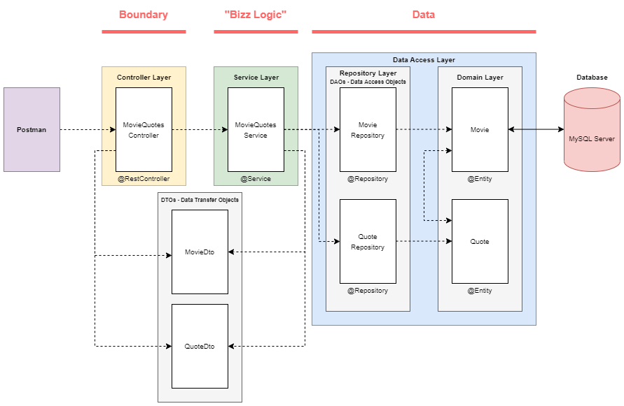

# IES - Lab 03

## 3.1

### a)

#### Dependências do Projeto Maven

Foi utilizado um archetype parent na aplicação web

```
    <parent>
        <groupId>org.springframework.boot</groupId>
        <artifactId>spring-boot-starter-parent</artifactId>
        <version>2.4.0</version>
    </parent>
    <dependencies>
        <dependency>
            <groupId>org.springframework.boot</groupId>
            <artifactId>spring-boot-starter-web</artifactId>
        </dependency>
        ...
    </dependencies>
```

O parent gere todas as dependências, versionamento e configuração de plugins no projeto.
Por isso, não é necessário especificar a versão de cada dependência no projeto!

As dependências utilizadas foram: **Spring Web**, **Thymeleaf**, **Spring Data JPA**, **H2 Database**, **Validation**.

#### Camada do Domínio (Domain Layer)

Foi criada uma única classe User, para modelar entidades de utilizadores.

```
    @Entity // ----------------------------------------------- Permite à implementação do JPA (Java Programming API) - Hibernate - executar operações CRUD sobre entidades do domínio.
    public class User {
        
        @Id // ----------------------------------------------- Identificador das entidades na tabela.
        @GeneratedValue(strategy = GenerationType.AUTO) // --- O valor do id é automaticamente incrementado.
        private long id;
        
        @NotBlank(message = "Name is mandatory") // ---------- Restrição do nome (NOT NULL).
        private String name;
        
        @NotBlank(message = "Email is mandatory") // --------- Restrição do email (NOT NULL).
        private String email;

        ...
    }   
```

[Anotações do Hibernate JPA](https://www.techferry.com/articles/hibernate-jpa-annotations.html)

#### Camada do Repositório (Repository Layer)

**DAO (Data Access Object)**: Fornece uma interface que abstrai o acesso a dados. Lê e escreve os dados diretamente da base de dados.

**Spring Data JPA**: permite a criação de repositórios JPA (implementação do padrão DAO) com funcionalidade CRUD, sem grandes problemas.
Para obter funcionalidade CRUD nos nossos objetos, basta **extender** a **interface do repositório** especificando o objeto a que este se aplica.

```
    @Repository // ------------------------------------------------------------- Classe fornece mecanismos CRUD sobre objetos.
    public interface UserRepository extends CrudRepository<User, Long> {} // --- CrudRepository extende a interface do repositório.
```

#### Camada do Controlador (Controller Layer)

Tem a responsabilidade **receber pedidos HTTP GET e POST**, e mapear esses pedidos a **chamadas à implementação do repositório** (UserRepository).

```
    @Controller
    public class UserController {
        
        @GetMapping("/signup") // ----------------------------------------------------------- Recebe pedidos GET em /signup.
        public String showSignUpForm(User user) {
            return "add-user";
        }
        
        // ---------------------------------------------------------------------------------- (C)RUD CREATE
        @PostMapping("/adduser") // --------------------------------------------------------- Recebe pedidos POST em /adduser.
        public String addUser(@Valid User user, BindingResult result, Model model) { // ----- @Valid: Verifica se "user" é válido de acordo com a sua modelação em User.
            if (result.hasErrors()) { // ---------------------------------------------------- Retornar se a validação de "user" der erro.
                return "add-user";
            }
            
            userRepository.save(user);
            return "redirect:/index"; // ---------------------------------------------------- Redireciona para a página /index, ao invés de carregar index na página atual (/adduser)!
        }
        
        // ---------------------------------------------------------------------------------- C(R)UD READ
        @GetMapping("/index") // ------------------------------------------------------------ Página inicial.
        public String showUserList(Model model) {
            model.addAttribute("users", userRepository.findAll());
            return "index";
        }
    
        @GetMapping("/edit/{id}") // -------------------------------------------------------- Recebe o id do utilizador.
        public String showUpdateForm(@PathVariable("id") long id, Model model) { // --------- @PathVariable: Mapeia o "id" fornecido no URL para a variável id.
            User user = userRepository.findById(id) // -------------------------------------- Procura utilizador pelo id, chamando um método do repositório.
            .orElseThrow(() -> new IllegalArgumentException("Invalid user Id:" + id)); // --- Retorna erro de utilizador não existir.
            
            model.addAttribute("user", user);
            return "update-user";
        }
        
        // ---------------------------------------------------------------------------------- CR(U)D UPDATE
        @PostMapping("/update/{id}")
        public String updateUser(@PathVariable("id") long id, @Valid User user, 
        BindingResult result, Model model) {
            if (result.hasErrors()) {
                user.setId(id);
                return "update-user";
            }
                
            userRepository.save(user);
            return "redirect:/index";
        }
        
        // ---------------------------------------------------------------------------------- CRU(D) DELETE
        @GetMapping("/delete/{id}")
        public String deleteUser(@PathVariable("id") long id, Model model) {
            User user = userRepository.findById(id)
            .orElseThrow(() -> new IllegalArgumentException("Invalid user Id:" + id));
            userRepository.delete(user);
            return "redirect:/index";
        }
    }
```

#### Camada da Vista (View Layer)

**Thymeleaf:** motor de templates que processa os ficheiros de templates.
As templates HTML devem ser armazenadas na diretoria `src/main/resources/templates`.

No ficheiro `add-user.html`, destaca-se a seguinte secção:
```
    <form action="#" th:action="@{/adduser}" th:object="${user}" method="post"> 
        <label for="name">Name</label>                                          
        <input type="text" th:field="*{name}" id="name" placeholder="Name">     
        <span th:if="${#fields.hasErrors('name')}" th:errors="*{name}"></span>  
        <label for="email">Email</label>
        <input type="text" th:field="*{email}" id="email" placeholder="Email">
        <span th:if="${#fields.hasErrors('email')}" th:errors="*{email}"></span>
        <input type="submit" value="Add User">   
    </form>
```

[Sintaxe das Expressões Thymeleaf](https://www.thymeleaf.org/doc/articles/standarddialect5minutes.html)
```
    ${...} : Expressão de variável ---------- Utilizam as variáveis de contexto, passadas pelo Controller.
    *{...} : Expressão de seleção ----------- Atributos de um objeto previamente selecionado, ao invés de todo o contexto de variáveis.
    #{...} : Expressão de mensagem (i18n) --- Imprime conteúdo baseado na localização/país.
    @{...} : Expressão de links URL --------- Converte expressão para URL, segundo o contexto da aplicação.
```

No ficheiro `index.html`, destaca-se a seguinte secção:
```
    <div th:switch="${users}">
        <h2 th:case="null">No users yet!</h2>
            <div th:case="*">
                <h2>Users</h2>
                <table>
                    <thead>
                        <tr>
                            <th>Name</th>
                            <th>Email</th>
                            <th>Edit</th>
                            <th>Delete</th>
                        </tr>
                    </thead>
                    <tbody>
                    <tr th:each="user : ${users}">
                        <td th:text="${user.name}"></td>
                        <td th:text="${user.email}"></td>
                        <td><a th:href="@{/edit/{id}(id=${user.id})}">Edit</a></td> // ------- Link para editar utilizador.
                        <td><a th:href="@{/delete/{id}(id=${user.id})}">Delete</a></td> // --- Link para apagar utilizador.
                    </tr>
                </tbody>
            </table>
        </div>      
        <p><a href="/signup">Add a new user</a></p>
    </div>
```

#### Executar a Aplicação

A aplicação está pronta a executar!

```
    @SpringBootApplication
    public class Application {
    
        public static void main(String[] args) {
            SpringApplication.run(Application.class, args);
        }
    }
```
### b)

The "UserController" class gets an instance of "userRepository" through its constructor; how is this new repository instantiated?
  - O "userRepository" é automaticamente instanciado e injetado como argumento do construtor da classe UserController pelo Spring Boot.
    Isto acontece pois o construtor possui a anotação **@AutoWired**, que permite ao Spring Boot resolver e injetar beans colaborativos
    no bean atual ("beans" são objetos geridos pelo container IOC do String).

List the methods invoked in the “userRepository” object by the “UserController”. Where are these methods defined?
  - Métodos do "userRepository" invocados pelo "UserController":
      - .findAll()
      - .save(User user)
      - .findById(long id)
      - .delete(User user)
  - Estes métodos estão declarados na interface "CrudRepository", a sua definição encontra-se feita na Spring Data JPA.

Where is the data being saved?
  - Os dados estão a ser guardados na base de dados em memória denominada H2 Database.

Where is the rule for the “not empty” email address defined?
  - Essa regra está definida na camada do domínio, mais especificamente em cima da declaração do atributo "email" da entidade User.

### c)

Para adicionar um novo atributo (phone), apenas foi necessário modificar a classe User (camada do domínio) e as templates HTML!

## 3.2

### a)

Executar servidor MySQL num Docker Container:
`docker run --name mysql5 -e MYSQL_ROOT_PASSWORD=secret1 -e MYSQL_DATABASE=demo -e MYSQL_USER=demo -e MYSQL_PASSWORD=secret2 -p 33060:3306 -d mysql/mysql-server:5.7`

Legenda: `-e`: variável de ambiente; `-p`: mapeamento de porto host:container; `-d`: detached, executa no background.

### b)

#### Dependências do Projeto Maven

As dependências utilizadas foram: **Spring Web**, **Spring Data JPA**, **MySQL Driver**, **Dev Tools**, **Validation**.

#### Estrutura dos Pacotes

```
 \- ies.lab3.e2.springbootcrudapi
     \- controller
         \- EmployeeController.java
     \- exception
         \- ErrorDetails.java
         \- GlobalExceptionHandler.java
         \- ResourceNotFoundException.java
     \- model
         \- Employee.java
     \- repository
         \- EmployeeRepository.java
     \- Application.java
```

### c) Employee.java

```
    @Entity // ----------------------------------------------- Indica ao JPA que a classe é uma entidade CRUD.
    @Table(name = "employees") // ---------------------------- Nome da tabela na BD.
    public class Employee {
        ...
        @Id // ----------------------------------------------- Identificadores das entidades na tabela.
        @GeneratedValue(strategy = GenerationType.AUTO) // --- O valor de id é automaticamente incrementado.
        public long getId() {
            return id;
        }
        ...
        @Column(name = "first_name", nullable = false) // ---- Nome da coluna e se o valor pode ser nulo.
        public String getFirstName() {
            return firstName;
        }
        ...
```

### d) EmployeeRepository.java

```
    @Repository
    public interface EmployeeRepository extends JpaRepository<Employee, Long> { }
```

### e) EmployeeController.java

```
    @RestController
    @RequestMapping("/api/v1")
    public class EmployeeController {
    
        @Autowired
        private EmployeeRepository employeeRepository;
    
        @GetMapping("/employees")
        ...
        
        @GetMapping("/employees/{id}")
        ...
        
        @PostMapping("/employees")
        ...
        
        @PutMapping("/employees/{id}")
        ...
        
        @DeleteMapping("/employees/{id}")
        ...
    }
```

#### Exception Handling em serviços RESTful

O Spring Boot oferece uma simples mas boa implementação para lidar com exceções.
No entanto, podemos definir as nossas próprias exceções e especificar um status na resposta HTTP.

```
    @ResponseStatus(value = HttpStatus.NOT_FOUND)
    public class ResourceNotFoundException extends Exception {
    
        private static final long serialVersionUID = 1L;
    
        public ResourceNotFoundException(String message) {
            super(message);
        }
    }
```

Podemos também personalizar a estrutura da resposta em caso de exceção.
Para isso, criamos uma classe `ErrorDetails` com os vários atributos, construtor e getters.

Para utilizarmos `ErrorDetails`, criamos uma nova classe que lide com todas as exceções (espíficas e globais) num mesmo lugar.

```
    @ControllerAdvice // --------------------------------------------------------------------------------------------------- Identifica um componente responsável por lidar com todas as exceções da aplicação.
    public class GlobalExceptionHandler {
        @ExceptionHandler(ResourceNotFoundException.class) // -------------------------------------------------------------- Identifica a exceção que executa o método abaixo.
        public ResponseEntity<?> resourceNotFoundException(ResourceNotFoundException ex, WebRequest request) {
            ErrorDetails errorDetails = new ErrorDetails(new Date(), ex.getMessage(), request.getDescription(false));
            return new ResponseEntity<>(errorDetails, HttpStatus.NOT_FOUND);
        }
    
        @ExceptionHandler(Exception.class)
        public ResponseEntity<?> globleExcpetionHandler(Exception ex, WebRequest request) {
            ErrorDetails errorDetails = new ErrorDetails(new Date(), ex.getMessage(), request.getDescription(false));
            return new ResponseEntity<>(errorDetails, HttpStatus.INTERNAL_SERVER_ERROR);
        }
    }
```

### f) 

**application.properties**: Permite configurar a ligação à base de dados MySQL e manter o esquema da mesma atualizado (conforme o modelo).

```
    # MySQL
    spring.datasource.url=jdbc:mysql://127.0.0.1:33060/demo
    spring.datasource.username=demo
    spring.datasource.password=secret2
    spring.jpa.database-platform=org.hibernate.dialect.MySQL5InnoDBDialect
    
    # Strategy to auto update the schemas (create, create-drop, validate, update)
    spring.jpa.hibernate.ddl-auto = update
```

**Teste dos endpoints**

| API Name        | HTTP Method | Path                     | Status Code      | Description                         |
| --------------- | ----------- | ------------------------ | ---------------- | ----------------------------------- |
| GET Employees   | GET         | `/api/v1/employees`      | 200 (OK)         | All Employee resources are fetched. |
| POST Employee   | POST        | `/api/v1/employees`      | 201 (CREATED)    | A new Employee resource is created  |
| GET Employee    | GET         | `/api/v1/employees/{id}` | 200 (OK)         | One Employee resource is fetched    |
| PUT Employee    | PUT         | `/api/v1/employees/{id}` | 200 (OK)         | Employee resource is updated        |
| DELETE Employee | DELETE      | `/api/v1/employees/{id}` | 204 (No Content) | Employee resource is deleted        |

#### Notas sobre o Postman

  - Para agrupar um grupo de requests, podemos criar uma coleção.
  - Para incluir os dados num request POST: `Body > raw > JSON`
```
    {   
        "firstName": "João",
        "lastName": "Fonseca",
        "emailId": "joao.fonseca@ua.pt"
    }
```
  - Podemos definir variáveis dentro da coleção, que podemos incluir nos requests, permitindo uma maior flexibilidade na testagem da API.
    Isso pode ser feito de duas formas:
      - Selecionar o texto no request que queremos transformar em variável, clicar no popup e dar um nome;
      - Clicar na coleção no menu lateral, ir à aba variáveis e dar um nome e valor à variável.
```
    Variável: id
    Valor: 1
    Utilização no request: localhost:8080/api/v1/employee/{{id}}
```

### g)

Adicionar um método de pesquisa de Employee pelo seu email:
 1. Adicionar ao EmployeeRepository o método correpondente `List<Employee> findByEmailId(String emailId);`.
      - Não precisamos de implementar este método, a Spring Data JPA consegue fazê-lo automaticamente!
 2. Adicionar o argumento `@RequestParam(name = "email", required = false) String emailId` ao método getAllEmployees do EmployeeController.
      - Se emailId não for nulo, deve ser retornado o resultado da chamada ao método `findByEmailId` do repositório.
      
Request de teste:
    `http://localhost:8080/api/v1/employees?email=pedro.fonseca@ua.pt`

## 3.3

#### Dependências do Projeto

As dependências utilizadas foram: **Spring Web**, **Spring Data JPA**, **MySQL Driver**, **Dev Tools**, **Validation**, **Lombok**.

**Lombok:** anotações que tornam uma classe mais legível e agilizam o desenvolvimento:
  - `@Getter / @Setter`: cria getters e/ou setters para um atributo.
  - `@ToString`: gera o método `toString` para a classe.
  - `@EqualsAndHashCode`: gera os métodos `equals` e `hashCode` para a classe.
  - `@Data`: `@Getter`, `@ToString` e `@EqualsAndHashCode` para todos os atributos, `@Setter` para todos os atributos não finais e `@RequiredArgsConstructor`.
  - `@NoArgsConstructor`: construtor sem parâmetros.
  - `@AllArgsConstructor`: construtor com todos os parâmetros.
[Mais anotações do Lombok](https://projectlombok.org/features/)

### a)

#### Execução do servidor MySQL num Docker Container

`docker run --name movie-quotes-db -e MYSQL_ROOT_PASSWORD=root -e MYSQL_DATABASE=movie-quotes -e MYSQL_USER=admin -e MYSQL_PASSWORD=admin -p 33060:3306 -d mysql/mysql-server:5.7`

#### Configuração de application.properties

```
# MySQL
spring.datasource.url=jdbc:mysql://127.0.0.1:33060/movie-quotes
spring.datasource.username=admin
spring.datasource.password=admin
spring.jpa.database-platform=org.hibernate.dialect.MySQL5InnoDBDialect

# Strategy to auto update the schemas (create, create-drop, validate, update)
spring.jpa.hibernate.ddl-auto = update
```

### b)

#### Camada do Domínio

Criaram-se as entidades Movie e Quote.

**Relação ManyToOne Quote-Movie:**

**Movie.java**
```
    @OneToMany(mappedBy = "movie", cascade = CascadeType.ALL) // Propagates actions to children (quotes)
    private List<Quote> quotes;
```

**Quote.java**
```
    @ManyToOne
    @JoinColumn(name = "movie_id", nullable = false) // Foreign Key that references the movie
    private Movie movie;
```

#### Camada do Repositório

**MovieRepository.java**
```
    @Repository
    public interface MovieRepository extends JpaRepository<Quote, Long> {
    
        @Query("SELECT DISTINCT quote.movie FROM Quote quote")
        List<Movie> findAllMoviesWithQuotes();
        
    }
```

**QuoteRepository.java**
```
    @Repository
    public interface QuoteRepository extends JpaRepository<Quote, Long> { }
```

#### Camada do Serviço

**MovieQuotesService.java**
```
    @Service
    public class MovieQuotesService {
    
        private MovieRepository movieRepository;
        private QuoteRepository quoteRepository;
        private Random rand;
        
        @Autowired
        public MovieQuotesService(MovieRepository movieRepository, QuoteRepository quoteRepository) {
            this.movieRepository = movieRepository;
            this.quoteRepository = quoteRepository;
            this.rand = new Random();
            // Run this once to fill database
            // List<Movie> movies = ImportData.fromFile("src/main/resources/static/data.csv");
            // movieRepository.saveAll(movies);
        }
        
        public ResponseEntity<QuoteDto> getRandomQuote() {
            List<Quote> quotes = quoteRepository.findAll();
            if (quotes.isEmpty()) {
                return new ResponseEntity<>(HttpStatus.NOT_FOUND);
            }
            Quote quote = quotes.get(rand.nextInt(quotes.size()));
            QuoteDto quoteDto = new QuoteDto(quote.getContent(), quote.getMovie().getId());
            return new ResponseEntity<>(quoteDto, HttpStatus.OK);
        }
        ...
    }
```

#### Camada do Controlador

**MovieQuotesController.java**
```
    @RestController
    @RequestMapping("/api")
    public class MovieQuotesController {
    
        @Autowired
        private MovieQuotesService movieQuotesService;
    
        @GetMapping("/quote")
        public ResponseEntity<QuoteDto> getRandomQuote() {
            return movieQuotesService.getRandomQuote();
        }
    
        @GetMapping("/shows")
        public ResponseEntity<List<MovieDto>> getAllMoviesWithQuotes() {
            return movieQuotesService.getAllMoviesWithQuotes();
        }
    
        @GetMapping("/quotes")
        public ResponseEntity<QuoteDto> getRandomQuoteByMovieId(@RequestParam(value = "show") Long id) {
            return movieQuotesService.getRandomQuoteByMovieId(id);
        }
        ...
    }
```

### c)

**MovieQuotesService.java**
```
    public ResponseEntity<QuoteDto> createQuote(@Valid QuoteDto quoteDto) {
        try {
            Optional<Movie> movie = movieRepository.findById(quoteDto.getMovieId());
            if (!movie.isPresent()) {
                return new ResponseEntity<>(HttpStatus.UNPROCESSABLE_ENTITY); // Foreign Key doesn't exist
            }
            Quote _quote = quoteRepository.save(new Quote(quoteDto.getQuote(), movie.get()));
            QuoteDto _quoteDto = new QuoteDto(_quote.getContent(), _quote.getMovie().getId());
            return new ResponseEntity<>(_quoteDto, HttpStatus.CREATED);
        } catch (Exception e) {
            return new ResponseEntity<>(HttpStatus.INTERNAL_SERVER_ERROR);
        }
    }

    public ResponseEntity<MovieDto> createMovie(@Valid MovieDto movieDto) {
        try {
            Movie _movie = movieRepository.save(new Movie(movieDto.getTitle(), movieDto.getYear(), new ArrayList<>()));
            MovieDto _movieDto = new MovieDto(_movie.getId(), _movie.getTitle(), _movie.getYear());
            return new ResponseEntity<>(_movieDto, HttpStatus.CREATED);
        } catch (Exception e) {
            return new ResponseEntity<>(HttpStatus.INTERNAL_SERVER_ERROR);
        }
    }
```

**MovieQuotesController.java**
```
    @PostMapping("/quotes")
    public ResponseEntity<QuoteDto> createQuote(@RequestBody QuoteDto quote) {
        return movieQuotesService.createQuote(quote);
    }

    @PostMapping("/shows")
    public ResponseEntity<MovieDto> createMovie(@RequestBody MovieDto movie) {
        return movieQuotesService.createMovie(movie);
    }
```

### d)

Dockerizar a App:
 1. Criar uma rede no Docker para permitir a comunicação entre a App e a BD.
        docker network create movie-quotes-net 
 2. Executar o MySQL Server na rede criada no Docker.
        docker run --name movie-quotes-db --network movie-quotes-net -e MYSQL_ROOT_PASSWORD=root -e MYSQL_DATABASE=movie-quotes -e MYSQL_USER=admin -e MYSQL_PASSWORD=admin -p 3306:3306 -d mysql/mysql-server:5.7
 3. Atualizar o ficheiro `application.properties`.

        spring.datasource.url=jdbc:mysql://movie-quotes-db:3306/movie-quotes
        spring.datasource.username=admin
        spring.datasource.password=admin

 4. Eliminar teste de `src/test/java/ies/lab3/e3/moviequotes/ApplicationTests.java`.
 5. Executar a fase `package` do Maven.
        mvn clean package
 6. Criar um Dockerfile.

        FROM eclipse-temurin:11-jdk-alpine
        VOLUME /tmp
        COPY target/*.jar app.jar
        COPY src/main/resources/static src/main/resources/static
        ENTRYPOINT ["java","-jar","/app.jar"]

 6. Construir a imagem da App (utiliza Dockerfile).
        docker build -t movie-quotes-image .
 7. Executar a App na rede criada no Docker.
        docker run --network movie-quotes-net --name movie-quotes-app -p 8080:8080 -d movie-quotes-image

Para configurar logo tudo relacionado ao Docker:

        docker network create movie-quotes-net
        docker run --name movie-quotes-db --network movie-quotes-net -e MYSQL_ROOT_PASSWORD=root -e MYSQL_DATABASE=movie-quotes -e MYSQL_USER=admin -e MYSQL_PASSWORD=admin -p 3306:3306 -d mysql/mysql-server:5.7
        docker build -t movie-quotes-image .
        docker run --network movie-quotes-net --name movie-quotes-app -p 8080:8080 -d movie-quotes-image

## Review Questions

### A)
**@Controller**:
  - Direcionada a **Spring MVC** controllers.
  - Especialização de @Component.
  - Permite retornar views no Spring Web MVC.
  - Permite incluir um atributo do tipo Model nos métodos, que permite a inserção de objetos nas templates retornadas.
 
**@RestController**:
  - Direcionada a **RESTful Web** services.
  - Especialização de controller. Inclui @Controller + @ResponseBody.
  - Permite retornar/enviar informação em formato JSON em pedidos HTTP.

### B)



**Postman**: Progama utilizado para efetuar os pedidos HTTP.

**Controller Layer**: Inclui o controlador `MovieQuotesController` anotada com `@RestController`. Apenas invoca métodos da Service Layer (não possui lógica).

**DTOs**: Modelação dos dados que são recebidos/enviados pela API em formato JSON. Permitem ocultar atributos / ocultar a estrutura das classes `@Entity` da Domain Layer.

**Service Layer**: Disponibiliza o serviço `MovieQuotesService` anotado com `@Service`. Referencia os repositorios dos movies e das quotes, fazendo de ponte entre a Controller Layer e a Data Access Layer. Inclui toda a lógica do negócio da aplicação.

**Data Access Layer**: Engloba as seguintes camadas:

  - **Repository Layer**: Fornece um Data Access Object (ou repository) para cada uma das entidades da Domain Layer. Implementa métodos que permitem a interação com os dados na base de dados, modelados pelas entidades.

  - **Domain Layer**: Modelação dos dados que são armazenados na base de dados.

**Database**: Foi utilizada a base de dados MySQL Server para garantir a persistência dos dados.

### C)
**@Table(name = "tb_name")**:
    Nome da tabela (da entidade anotada) na BD.

**@Column(name = "col_name", nullable = false)**:
    Nome da coluna da tabela, e se o valor pode ser nulo.

**@Id**:
    Coluna do identificador (id) das entidades na tabela, que as distingue entre si.

### D)
**@AutoWired**:
    Permite ao Spring Boot resolver e injetar beans colaborativos no bean atual ("beans" são objetos geridos pelo container IOC do String).
    Desta forma, não precisamos de ser nós a instanciar o objeto.
